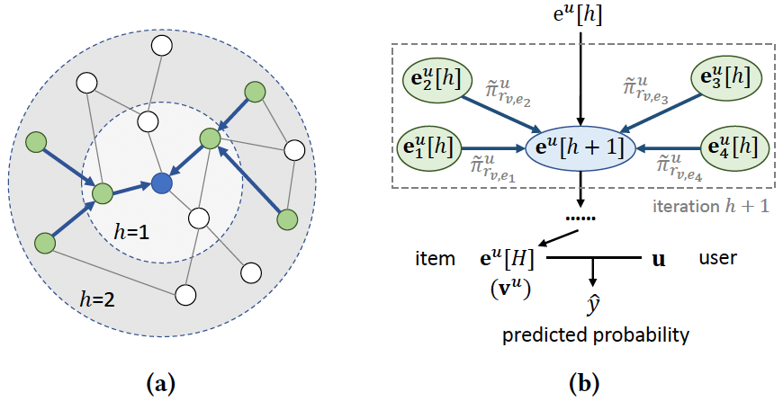

# CS6208: Paper Review
> **Student:** Kong Lingdong (A0260240X)<br>
> **Title:** "User-Specific Recommendation with K-GCN"<br>
> **Time:** AY 2022-2023, Semester II

## About
This repository contains the code and implementation details of the Paper Review assignment for the CS6208 course. In this assignment, we review Knowledge Graph Convolutional Network (K-GCN), with an application on a movie recommendation scenarios.

Collaborative filtering is a traditional technique for solving user-specific recommendation problems, but it has several drawbacks, such as the sparsity of user-item interactions. [(Wang et al., 2018)](https://arxiv.org/abs/1803.03467) and [(Huang et al., 2018)](https://static.aminer.cn/upload/pdf/890/478/667/5b67b46f17c44aac1c8631c3_0.pdf) have used knowledge graphs (KG) to overcome these issues, which are heterogeneous graphs with `nodes` and `edges` representing item `attributes` and `relations`, respectively, and build feature- and connection-rich scenarios to improve precision. Graph neural networks, specifically graph convolutional networks (GCN), have become powerful tools for processing such data. [(Wang et al., 2019)](https://arxiv.org/abs/1904.12575) combined KG and GCN in recommendation systems to achieve good performance on multiple datasets. This assignment reviews this knowledge graph convolutional network (K-GCN) through a user-specific movie recommendation problem.

<p align="center">
  
  <br>
  Fig. Illustrations of (a) A two-layer receptive field of an entity (blue node) in a KG. (b) The framework of K-GCN. Images adopted from (Wang et al., 2019).
</p>


## Installation
This codebase is tested with `torch==1.11.0` with `CUDA 11.3`. In order to successfully reproduce the results reported, we recommend to follow the exact same configuation. However, similar versions that came out lately should be good as well.

- Step 1: Create Enviroment
```
conda create -n my_kgcn python=3.10
```
- Step 2: Activate Enviroment
```
conda activate my_kgcn
```
- Step 3: Install PyTorch
```
conda install pytorch==1.11.0 torchvision==0.12.0 cudatoolkit=11.3 -c pytorch
```
- Step 4: Install Necessary Libraries
```
pip install numpy matplotlib sklearn
```

## Data Preparation
We subsample a 10\% subset of MovieLens-20M as our dataset, where ratings greater than 3 are considered positive. We split the dataset into a training set and a test set in an 8:2 ratio and use the KG from [(Wang et al., 2019)](https://arxiv.org/abs/1904.12575).


## Getting Started


## Result

